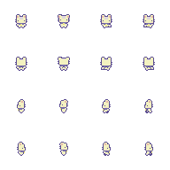

# My Study Companion (AI Desktop Pet)

<p align="center">
  
</p>

<p align="center">
  <b>A cute, 2D pixel-art desktop pet and multimodal AI study buddy powered by Google Gemini.</b><br>
  <i>Perched on your screen, ready to explain code, notes, lectures, or diagrams with a single click or hotkey.</i>
</p>

<p align="center">
  <a href="#key-features"></a>
  <a href="#tech-stack"></a>
  <a href="#key-features"></a>
  <a href="#controls--hotkeys"></a>
</p>

---

## Table of Contents

- [Overview](#overview)
- [Key Features](#key-features)
- [Controls & Hotkeys](#controls--hotkeys)
- [Tech Stack](#tech-stack)
- [Project Architecture](#project-architecture)
- [Getting Started](#getting-started)
  - [Prerequisites](#prerequisites)
  - [Installation & Setup](#installation--setup)
  - [Getting a Gemini API Key](#getting-a-gemini-api-key)
- [How It Works](#how-it-works)
  - [Automatic Model Fallback System](#automatic-model-fallback-system)
  - [Custom Markdown Rendering](#custom-markdown-rendering)
  - [Multi-Screenshot Context](#multi-screenshot-context)
- [Configuration](#configuration)
- [Troubleshooting](#troubleshooting)

---

## Overview

**My Study Companion** lives directly on your desktop as an animated pixel-art dog that floats above your active windows. Whether you are debugging stubborn code, reading research papers, or studying slides, your companion can instantly grab your screen, analyze what is visible, and explain complex concepts in clear, friendly language.

Unlike web interfaces where you have to take a screenshot, save it, upload it, and prompt the AI manually, this companion does it all in a **single keyboard shortcut** or a **right-click**.

> **Note**: I fully vibecoded this entire project in an hour or two using Antigravity. I honestly have no idea how half of this works under the hood, so please don't ask me hehe. If it works, do not touch it!

---

## Key Features

- **Floating 2D Pixel-Art Pet**: Transparent, borderless window with smooth multi-frame animations (idle, walk, thinking, happy, sleeping). Drag and place him anywhere on your desktop.
- **One-Shot "Explain Screen"**: Right-click the pet and click **Explain Screen** (or press `Ctrl + Alt + E`) to snap the current screen and have Gemini explain it immediately without typing a single word.
- **Global System Hotkeys**: Works from anywhere on your computer, even while gaming or working in full-screen IDEs.
- **Multi-Screenshot Context**: Add multiple screenshots across different windows, tabs, or editor files into one session to build rich visual context for your questions.
- **Intelligent Model Fallback**: If you hit quota or rate limits (HTTP 429), the companion automatically falls back to secondary models (`gemini-2.5-flash` -> `gemini-2.5-flash-lite` -> `gemini-3.5-flash-lite` -> `gemini-1.5-flash` -> `gemini-1.5-flash-8b`) without interrupting your work.
- **Cozy Warm Cream UI**: The chat interface matches the pet's sprite colors (warm ivory, soft cream, honey accents, lavender code blocks, and sage buttons) for a minimal, distraction-free aesthetic.
- **Custom Canvas Markdown Parser**: Clean formatting for headings, bullet points, blockquotes, inline code, and syntax-highlighted code blocks rendered directly in pure Tkinter.
- **Multi-Turn Conversational Memory**: Keeps track of prior messages in the session so you can ask natural follow-up questions about previous explanations.

---

## Controls & Hotkeys

| Action | Shortcut / Input | Description |
|---|---|---|
| **One-Shot Explain** | `Ctrl + Alt + E` | Snaps active screen and automatically prompts Gemini to explain everything visible |
| **Capture & Open Chat** | `Ctrl + Alt + S` | Captures screen, opens the chat window, and lets you review or ask custom questions |
| **Explain via Menu** | Right-click Pet -> `Explain Screen` | Instant capture and automatic explanation |
| **Open Chat via Menu** | Right-click Pet -> `Open Chat` | Opens the companion chat window |
| **Quit App** | Right-click Pet -> `Quit` | Safely cleans up hotkeys and exits |
| **Reposition Pet** | Left-click + Drag | Move your companion to any corner of your monitor |
| **Add Extra Screenshot** | `+ Add` button in chat | Takes another screenshot and adds it to the AI's current context |
| **Reset Screenshots** | `Clear` button in chat | Removes stored screenshots for the turn |

---

## Tech Stack

- **Language**: Python 3.10+
- **AI Brain**: Google Gemini API via official [`google-genai`](https://github.com/googleapis/python-genai) SDK
- **GUI Engine**: Python standard `tkinter` with customized transparent canvas overlays and custom double-buffered Markdown rendering
- **Screen Capture**: [`mss`](https://github.com/BoboTiG/python-mss) for ultra-fast, multi-monitor screenshot capture
- **Image Processing**: [`Pillow (PIL)`](https://python-pillow.org/) for pixel-perfect sprite slicing, scaling, and thumbnail generation
- **System Hotkeys**: [`pynput`](https://github.com/moses-palmer/pynput) for non-blocking global hotkey listening
- **Environment**: [`python-dotenv`](https://github.com/theskumar/python-dotenv) for secure configuration

---

## Project Architecture

```
my-study-companion/
├── assets/
│   └── pet/
│       └── Basic_Charakter_Spritesheet.png  # 4x4 Pixel art animation sheet
├── src/
│   ├── pet/
│   │   ├── pet.py            # Pet window, transparent overlay, animation loop
│   │   └── drag.py           # Drag-and-drop mouse physics
│   ├── ui/
│   │   ├── chat.py           # Custom Tkinter canvas-based Markdown renderer
│   │   └── window.py         # Warm cream chat window, screenshot strip, inputs
│   ├── ai.py                 # Gemini API integration & automatic model fallback
│   ├── app.py                # Main application orchestrator & event bus
│   ├── config.py             # Configurable settings (hotkeys, scaling, prompts)
│   ├── hotkeys.py            # Thread-safe global hotkey listener
│   ├── memory.py             # Multi-screenshot holder & conversation history
│   └── screen.py             # High-performance screen capture helper
├── .env.example              # Sample environment configuration
├── .gitignore
├── requirements.txt          # Python dependencies
└── README.md
```

---

## Getting Started

### Prerequisites

1. **Windows 10 / 11**
2. **Python 3.10+** installed and added to your `PATH` ([Download Python](https://www.python.org/downloads/))
3. A **Google Gemini API Key** (Free tier available at [Google AI Studio](https://aistudio.google.com/app/apikey))

---

### Installation & Setup

1. **Clone the repository**:
   ```bash
   git clone https://github.com/YOUR_USERNAME/my-study-companion.git
   cd my-study-companion
   ```

2. **Create and activate a virtual environment**:
   ```powershell
   # Windows PowerShell
   python -m venv .venv
   .venv\Scripts\Activate.ps1
   ```

3. **Install dependencies**:
   ```powershell
   pip install -r requirements.txt
   ```

4. **Configure your API Key**:
   Copy the `.env.example` file to `.env`:
   ```powershell
   copy .env.example .env
   ```
   Open `.env` in any text editor and paste your Gemini API key:
   ```env
   GEMINI_API_KEY=AIzaSyYourActualKeyHere...
   ```

5. **Run the application**:
   ```powershell
   python src/app.py
   ```

Your cute pixel-art companion will appear in the bottom-right corner of your desktop.

---

## How It Works

### Pet Animation & Transparency
`src/pet/pet.py` creates a frameless `tk.Toplevel` window configured with `-transparentcolor` to completely remove background pixels around the sprite. The sprite sheet (`Basic_Charakter_Spritesheet.png`) is sliced into individual 48x48 frames, scaled smoothly using nearest-neighbor interpolation to preserve pixel crispness, and cycled via Tkinter's `after()` event loop.

### Automatic Model Fallback System
Rate limits and quotas can disrupt your study sessions. In `src/ai.py`, when a call encounters a `429 Too Many Requests` or `RESOURCE_EXHAUSTED` error, it automatically cycles through fallback models in order:

```
gemini-2.5-flash -> gemini-2.5-flash-lite -> gemini-3.5-flash-lite -> gemini-1.5-flash -> gemini-1.5-flash-8b
```

The active model name is displayed directly on the badge in the chat window header so you always know which model produced the answer.

### Custom Markdown Rendering
Rather than embedding heavy browser engines (like CEF or Electron), `src/ui/chat.py` implements a lightweight, pure-Python Markdown parser directly onto a Tkinter `Text` widget with custom tags:
- **Headings**: Scaled font sizes with distinct warm brown tones
- **Code Blocks**: Formatted with monospace typography on a soft lavender backdrop
- **Lists**: Clean hanging indents with bullet symbols
- **Blockquotes**: Indented italicized text with decorative left bars

### Multi-Screenshot Context
Using `mss`, taking a screenshot takes less than 50 milliseconds. When working on problems spanning multiple files (for example, an error log in a terminal and source code in your editor), you can click **`+ Add`** to attach successive screenshots to the current conversation memory. All screenshots are converted to PIL Images and submitted concurrently to Gemini's vision pipeline.

---

## Configuration

You can customize hotkeys, pet size, animations, and models directly in [`src/config.py`](file:///c:/Krishna/Serious%20Projects/my-study-companion/src/config.py):

| Setting | Default Value | Description |
|---|---|---|
| `PET_SCALE` | `4.0` | Scaling multiplier for the pixel-art pet sprite |
| `ANIMATION_SPEED_MS` | `150` | Milliseconds per animation frame |
| `HOTKEY_MODIFIERS` | `{"ctrl", "alt"}` | Modifier keys for capture & chat hotkey |
| `HOTKEY_KEY` | `"s"` | Trigger key for capture & chat (`Ctrl+Alt+S`) |
| `EXPLAIN_HOTKEY_KEY` | `"e"` | Trigger key for one-shot explain (`Ctrl+Alt+E`) |
| `GEMINI_MODEL` | `"gemini-2.5-flash"` | Primary model used for reasoning and vision |
| `EXPLAIN_PROMPT` | *(Educational prompt)* | The prompt sent automatically on "Explain Screen" |

---

## Troubleshooting

- **Pet background is not transparent**: Ensure you are running on Windows. Transparent color keying is native to the Windows desktop window manager.
- **Hotkey does not respond**: Check if another application (like GeForce Experience or Discord) is intercepting `Ctrl+Alt+S` or `Ctrl+Alt+E`. You can change the key combinations in `src/config.py`.
- **`GEMINI_API_KEY is not set`**: Double check that your `.env` file is named exactly `.env` (not `.env.txt`) and is placed in the root folder of the project.
- **PowerShell Execution Policy Error**: If activating the virtual environment is blocked, run:
  ```powershell
  Set-ExecutionPolicy -Scope Process -ExecutionPolicy Bypass
  ```

---

<p align="center">
  Made with ❤️ for students, developers, and lifelong learners.
</p>
